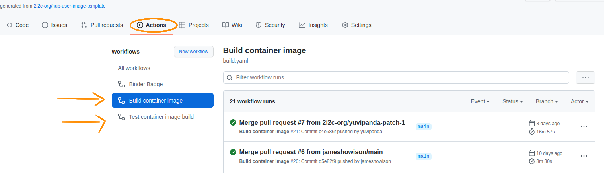
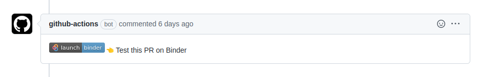

# awi-ciroh-image

This is a repository for creating dedicated user images for CIROH-2i2c JupyterHub.
The `main` branch provides the most up-to-date template, while the other branches host both alternate images and development branches.

This repository's workflow feeds its branches into the [repo2docker](https://github.com/jupyterhub/repo2docker) toolchain. For more in-depth coverage of the toolchain's capabilities, please see the [repo2docker documentation](https://repo2docker.readthedocs.io/en/latest/).

From there, the GitHub Action CI/CD workflow pushes completed images to to the [quay.io/awiciroh](https://quay.io/user/awiciroh) registry.

# Creating a new image

Depending on your needs, there are a few primary paths for creating new 2i2c images.

Alternatively, you can also **request an image to be created** by creating a ticket on the [issues page](https://github.com/CIROH-UA/awi-ciroh-image/issues). If you do, please be sure to provide an `environment.yml`, `requirements.txt`, or other configuration file.

## Creating an image from a configuration file
This is typically the most appropriate approach for general use cases, such as configuring an environment to run Python code.  
Before completing this process, create or export a file documenting your project's dependencies. For Python projects, this will typically be a `requirements.txt` file or a Conda `environment.yml` file.  
For other types of environments, the repo2docker documentation provides [a full listing of supported configuration files](https://repo2docker.readthedocs.io/en/latest/configuration/).

   
<i>Click to expand...</i>

   <ol>
      <li>If necessary, create a personal fork of this repository.</li>
      <li>Create a new branch off of the <code>main</code> branch. Give it a name that describes your environment, <bode>preferably-using-kebab-case</code>.</li>
      <li>Delete the Dockerfile at the root of the branch. (Otherwise, it will override any environment files you provide.)</li>
      <li>Place your configuration file at the root of the repository.</li>
   </ol>
   
If a working environment is provided, the above steps are sufficient to create a working image. However, this image will not support HydroShare integrations with `nbfetch` unless the following additional steps are taken:
   <ol>
      <li>Create a new, empty plaintext file called `postBuild`. (Do not include a file extension.)</li>
      <li>
         Add the following content to the new file: 
         <code>
            #!/bin/bash 
            jupyter server extension enable --py nbfetch --sys-prefix
         </code>
      </li>
   </ol>

 

If you have completed these steps on a fork, you can submit a PR back to the `CIROH-UA/awi-ciroh-image` repository to have your changes included on a branch, allowing your image to be hosted on CIROH-2i2c JupyterHub.

## Creating an image from the default template
This approach is typically appropriate for more involved configurations, allowing for full editing of a Dockerfile. The Dockerfile overrides any provided environment files, which can be inconvenient.

(Consider using a configuration file alongside the `postBuild` script instead for minor configuration changes, as seen in the [above steps](#creating-an-image-from-a-configuration-file).)

   
<i>Click to expand...</i>

   <ol>
      <li>If necessary, create a personal fork of this repository.</li>
      <li>Create a new branch off of the <code>main</code> branch. Give it a name that describes your environment, <bode>preferably-using-kebab-case</code>.</li>
      <li>Edit the provided default Dockerfile to your liking.
   </ol>

 

The guidance in the [Advanced Binder Documentation](https://mybinder.readthedocs.io/en/latest/tutorials/dockerfile.html) may be worth a look, as it provides best practices for reproducibility.

## Creating a NextGen-based image
If you'd like to work with the NextGen framework, this approach will yield an image with the dependencies you need.

   
<i>Click to expand...</i>

   <ol>
      <li>If necessary, create a personal fork of this repository.</li>
      <li>Create a new branch off of the <code>ngen-2i2c</code> branch. Give it a name that describes your environment, <bode>preferably-using-kebab-case</code>.</li>
      <li>Edit the provided default Dockerfile to your liking.
   </ol>

 

If you'd like to contribute changes to the `ngen-2i2c` branch, these steps will also allow you to test and submit those changes as a PR.

# GitHub workflows

This template repository provides several GitHub workflows that build and push the image to quay.io when configured.

## Build and push container image :arrow_right: [build.yaml](https://github.com/ciroh-ua/awi-ciroh-image/blob/main/.github/workflows/build.yaml)

This workflow is triggered by every pushed commit on the main branch of the repo (including when a PR is merged).
It **builds** the image and **pushes** it to the registry.

## Branch Build and push container image :arrow_right: [build_branch.yaml](https://github.com/ciroh-ua/awi-ciroh-image/blob/main/.github/workflows/build.yaml)

This workflow is triggered manually on non-main branches of the repo, being responsible for publishing additional images.
It **builds** the image and **pushes** it to the registry. Currently, it is set by default to target `quay.io/awiciroh/devcon26:{branch-name}`, but this can be configured on a per-branch basis.

## Test container image build :arrow_right: [test.yaml](https://github.com/ciroh-ua/awi-ciroh-image/blob/MAIN/.github/workflows/test.yaml)

This workflow is triggered by every Pull Request commit and it **builds** the image, but it **doesn't** push it to the registry, unless explicitly configured to do so. Check out [this section](#enable-quayio-image-push-for-testyaml) on how to enable image pushes on Pull Requests.

## Test this PR on Binder Badge :arrow_right: [binder.yaml](https://github.com/ciroh-ua/awi-ciroh-image/blob/MAIN/.github/workflows/binder.yaml)

This workflow posts a comment inside a pull request, every time a pull request gets opened. The comment contains a "Test this PR on Binder" badge, which can be used to access the image defined by the PR in [mybinder.org](https://mybinder.org/).

